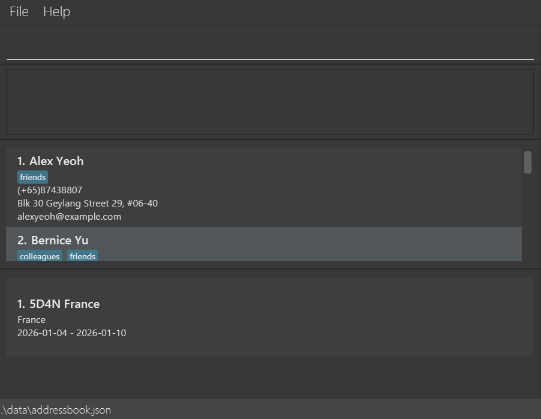

# TripScribe

## Overview

TripScribe is a desktop application made to help tour agency operations executives **keep track of contacts across
different itineraries**. It is a CLI based application optimized for fast typers. It features a GUI for visual feedback  

## Target Users

The target users are operations executives at a small to mid-sized tour agency who manages client bookings and
itineraries. Their role would involve frequently updating itineraries, client details and vendor booking notes, while
coordinating across multiple groups such as transport providers, tour guides, vendors, and tourists.

## Key features

### Contact management
* Add new contacts (i.e. vendors, clients) with tags for easy identification
* List all contacts for a quick glance at information
* Remove past contacts for previous itineraries

### Itinerary management
* Add new itineraries to contacts to keep track of their upcoming trips

## Product Website

* For the detailed documentation of this project, see the **[TripScribe Product Website](https://ay2526s2-cs2103t-f12-1.github.io/tp/)**.

### Acknowledgements

This project is based on the AddressBook-Level3 project created by the [SE-EDU initiative](https://se-education.org).
